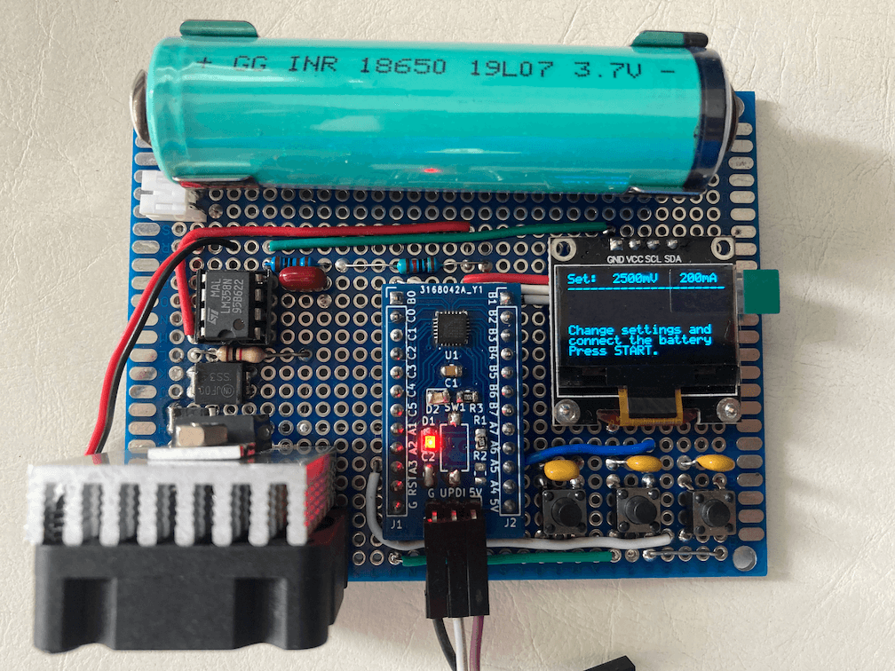

# Li-Ion, LiPo Battery Capacity Tester
The battery capacity tester measures the capacity of single-cell Li-Ion, LiPo (and LiFePO4) batteries using the built-in constant current load.

## Hardware
The project is based on the design from https://github.com/wagiminator/ATtiny412-BatteryCapacityTester with the following hardware modification:
1. Use an ATtiny3217 instead of ATtiny412;
2. Use an LM358 instead of LMV321;
3. Connect 3 buttons directly to 3 GPIO pins instead of wiring 3 buttons to an ADC input with a resistor array. Add a 1uF capacitor across each button for debouncing;
4. Solder everytng on a protoboard instead of fabricating a PCB;
5. Battery Connector for 18650 capable to support non-protected 18650 and protected 18650;
6. Add JST connector for Li-Po/Li-Ion battery;
7. No battery holder for CR123A battery.

## Software
The software is modified according due to the change of the hardware, plus more: 
1. Modified the code to connect each button to a GPIO pin instead of 
using one ADC pin;
2. Remove some magic numbers in the code and replace those magic numberswith #define macros;
3. Rewrite DAC_init() and only be called after user selected cut-off voltage;
4. `DAC_setLoad()` no longer needed and integrated into `DAC_init()`;
5. Correct OLED initialization commands for 8-line screen;
6. Re-arrange the display information and prompts to full utilize the 8-line display;
7. Fix the bugs in VREF configuration for DAC [here](https://github.com/wagiminator/ATtiny412-BatteryCapacityTester/pull/1).
 
## Note
Although the schematic shows the use of a bare ATtiny3217 chip, but in actual implementation I use a readily-made [ATtiny3217 development board](https://github.com/e-tinkers/attiny3217) that I made in 2020 for the project which makes it easier for prototyping and without the need for addition PCB fabrication.

## Blog
Further details about the project can be found on my block at [e-tinkers.com](https://www.e-tinkers.com/2026/02/build-a-li-ion-li-po-battery-capacity-tester/)

